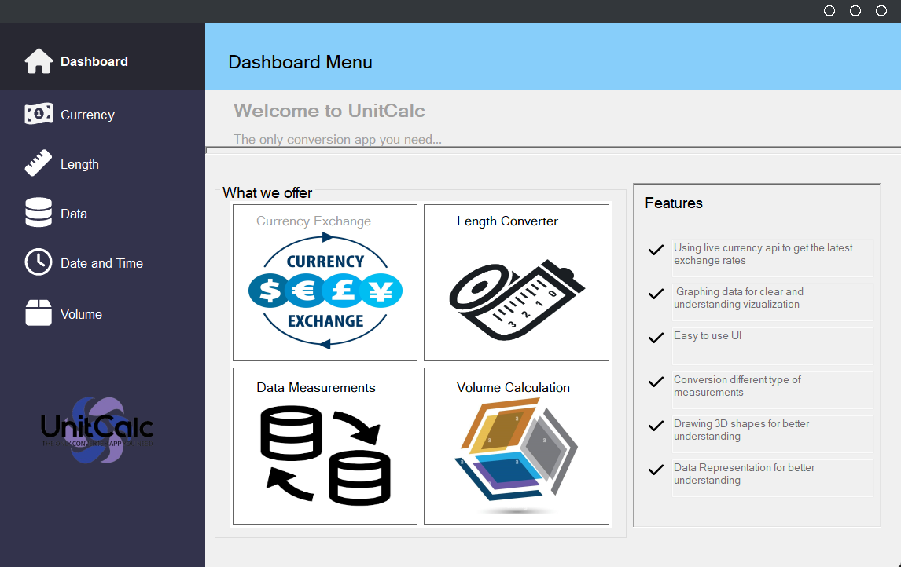
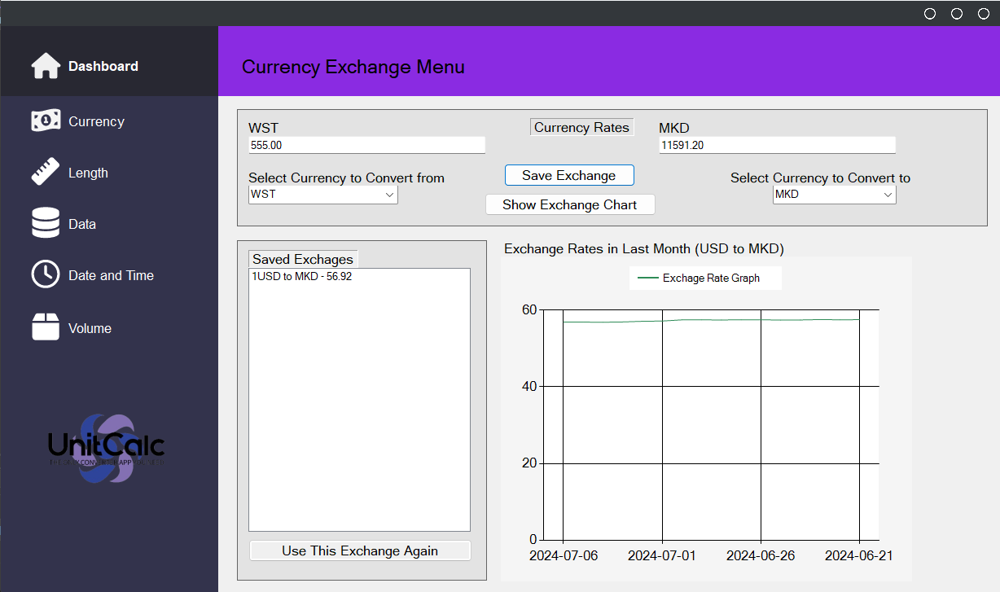
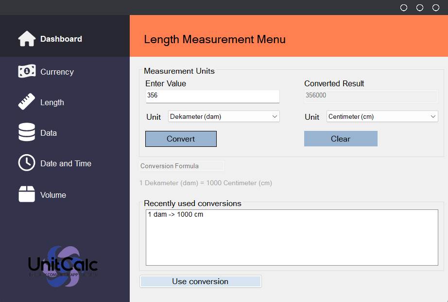

#  Конверзија на валути и други мерни единици
---

## 1. Опис на апликацијата
---

„Конверзија на валути и други мерни единци“ претставува апликација која што има за цел да врши претварање од една 
во друга мерна единица. Во оваа апликација, ние вклучивме различни мерни единци, како мерни единици за валути, должина,
големина на податоци, датум и време, и волумен. Со помош на ‘user friendly interface’, овозможивме лесна и пријатна
работа на корисникот и користејќи live API и график му овозможивме на корисникот да ја следи моменталната флуктуација
на валутите низ светот.

## 2. Упатство за користење
---

###     2.1 Прва страна- Dashboard

Отварајќи ја нашата апликација, ќе ве пречека почетната страница- Dashboard, која дава кратко и јасно објаснување за
функционалностите и можностите на нашата апликација, односно конверзија на валути, конверзија на мерни единици за 
должина,
големина на податоци и волумен, датум и време, користење на графови за визуализација на податоците.
Доколку сакате да почнете со конверзија, на левата страна ви е понудено мени
од кое можете да изберете кој тип на конверзија сакате да извршувате:
• Currency
• Length
• Data
• Date and Time
• Volume

Имплементација:

Мените кое се наоѓа на левата страна од прозорецот е составено од копчиња кои овозможуваат на Event-Click отварање на 
нови делови од апликацијата опишани во самото копче. Се користи Framework FontAwesome.Sharp за подобра прегледност и
дизајн, односно се додаваат икони кои се надополнуваат на дизајнот.

###     2.2 Currency Menu

Currency делот од нашата апликација се справува со конверзија, репрезентација и визуелизација на валути и нивните 
моментални вредности на пазарот.
Kарактеристики на мени:
• Управување со податоци за валути – ги презема податоците од моменталната курсна листа за селектираните валути со
помош 
на currency API (Currency Conversion API | Currencyapi.com) , и со овие податоци ги пополнува ComboBox’s со валидните 
валути.
• Конверзија на валути  - Овозможува на корисниците да внесуваат износи во една валута (from_currency) и ги конвертира
во друга валута (to_currency) според избраните курсеви на размена. Динамички го освежува корисничкиот интерфејс додека 
корисниците внесуваат вредности или ги менуваат селектираните валути.
• Историски курсеви на размена - Добива историски курсеви на размена помеѓу избрани валути за последните 30 дена од
истиот 
надворешен API со цел споредба на вредностите низ минатото
• Графичка интерпретација – со клик на копчето Show Exchange Chart графички ги прикажува податоците  за избраните
валути
во минатите 30 дена и како тоа тие флактуирале низ истиот период.

###     2.3 Length Menu

Length делот од нашата апликација врши конверзија помеѓу различни мерки за должина. Со внесување на вредност во textbox
(tbValueFrom), избор на некоја од понудените мерки за должина од двата combobox (cbFrom и cbTo) и кликнување на копчето 
Convert (btnConvert) се добива саканиот резултат, кој се сместува во textbox (tbValueTo). Притоа се врши проверка дали 
се селектирани мерни единици од двата листа (comboBox cbFrom и cbTo), па доколку не се селектирани се прикажува 
соодветна
порака преку MessageBox.Show().
Од податочни структури во оваа имплементација се користи хеширање со мапи, т.е на почетокот се дефинира 
Dictionary<string
, double> наречен conversionFactors, каде што се чуваат конверзиските фактори помеѓу различни единици за должина како 
вредности за различни комбинации од единици.
При внес и пополнување на полињата се проверува дали постои конверзиски фактор за избраните единици и се врши пресметка 
на резултатот.
Доколку сакаме повторно да извршиме друга конверзија, со кликнување на копчето Clear (btnClear) се чисти textbox 
(tbValueFrom и tbValueTo) и двата combobox(cbFrom и cbTo), овозможувајќи повторен внес на други вредности.
Исто така, при кликнување на копчето Convert во label (lbExplanation) се испишува формулата за конкретната конверзија,
во формат “1m = 100 cm“.
Исто така, при секое кликнување на копчето Convert, во listbox (lbUsedConversions) се зачувува конкретната конверзја, 
која потоа може да биде реискористена, со кликнување на копчето Use conversion.
Исто така за репрезентација на мерните едници имплементирана е класата Conversion.cs со overriden метода за ToString.

